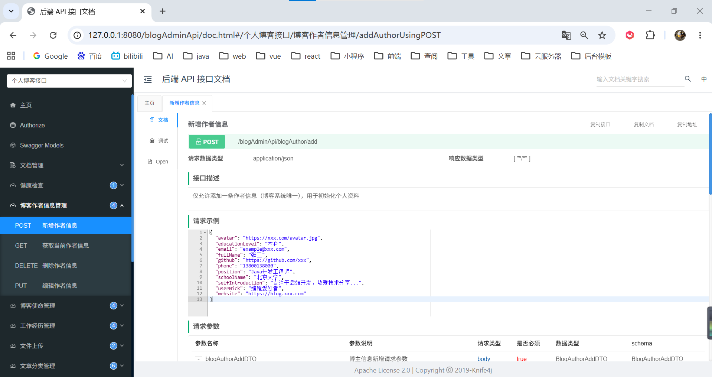

# 个人博客后台管理 API 接口


## 📖 项目简介

这是一个基于 Spring Boot 开发的**个人博客后台 API 接口**项目，为博客后台管理系统提供完整的管理功能，包括文章管理、分类管理、标签管理、用户管理、权限控制、文件上传等核心功能。

项目采用 **JWT 双 Token 机制**进行身份认证，支持 **Redis 缓存**加速查询，并集成了 **Knife4j** 提供交互式 API 文档。
> 博客在线预览 https://pzhdv.cn

### 项目仓库
- 前端：https://github.com/pzhdv/blog
- 前端 API：https://github.com/pzhdv/blog-api
- 后台管理：https://github.com/pzhdv/blog-admin
- 后台 API：https://github.com/pzhdv/blog-admin-api

## 🚀 技术栈

| 技术 | 版本 | 说明 |
|------|------|------|
| Spring Boot | 2.7.6 | 后端核心框架 |
| MyBatis-Plus | 3.5.15 | ORM 框架（增强 CRUD 能力） |
| MySQL | 8.0+ | 关系型数据库 |
| Redis | 6.0+ | 缓存数据库 |
| JWT | 0.11.5 | 身份认证（双 Token 机制） |
| Knife4j | 3.0.3 | API 文档工具（Swagger 3.0） |
| 腾讯云 COS | 5.6.227 | 对象存储服务 |
| Lombok | - | 简化实体类代码 |
| HikariCP | - | 数据库连接池（高性能） |
| Java | 17 | 运行环境 |

## 🏗️ 项目结构

```
blog-admin-api/
├── src/main/java/cn/pzhdv/blog/
│   ├── BlogAdminApiApplication.java     # Spring Boot 启动类
│   ├── config/                           # 配置类
│   │   ├── CrossConfig.java              # 跨域配置
│   │   ├── DruidConfig.java              # Druid 连接池配置
│   │   ├── RedisConfig.java              # Redis 配置
│   │   ├── WebMvcConfig.java             # Web MVC 配置
│   │   └── Knife4jConfig.java            # Knife4j 文档配置
│   ├── constant/                         # 常量定义
│   ├── controller/                       # 控制器层 (25个)
│   │   ├── AuthController.java           # 认证接口
│   │   ├── ArticleController.java        # 文章管理
│   │   ├── ArticleCategoryController.java # 分类管理
│   │   ├── ArticleTagController.java      # 标签管理
│   │   ├── SystemUserController.java     # 系统用户
│   │   ├── SysMenuController.java        # 菜单管理
│   │   ├── SysRoleController.java        # 角色管理
│   │   ├── SysOperationLogController.java # 操作日志管理
│   │   ├── FileUploadController.java    # 文件上传
│   │   └── ...
│   ├── dto/                              # 数据传输对象 (22个)
│   │   ├── request/                      # 请求 DTO
│   │   └── response/                     # 响应 DTO
│   ├── entity/                           # 实体类 (15个)
│   │   └── vo/                           # 视图对象
│   ├── exception/                        # 异常处理
│   │   ├── BusinessException.java        # 业务异常
│   │   └── GlobalExceptionHandler.java   # 全局异常处理器
│   ├── interceptor/                      # 拦截器
│   │   └── JwtInterceptor.java          # JWT 认证拦截器
│   ├── mapper/                           # 数据访问层 (15个)
│   ├── result/                           # 统一返回结果
│   │   ├── Result.java                   # 统一响应体
│   │   ├── ResultCode.java               # 响应状态码枚举
│   │   └── ResultUtil.java               # 响应工具类
│   ├── service/                          # 业务逻辑层 (15个)
│   │   └── impl/                         # 业务逻辑实现
│   └── utils/                            # 工具类
│       ├── JwtTokenUtil.java             # JWT 工具类
│       ├── PasswordUtil.java             # 密码加密工具
│       ├── IpUtils.java                  # IP 地址工具
│       └── CacheExpireUtil.java          # 缓存过期工具
├── src/main/resources/
│   ├── mapper/                           # MyBatis XML 映射文件 (15个)
│   ├── application.yml                   # 主配置文件
│   ├── application-dev.yml              # 开发环境配置
│   ├── application-prod.yml             # 生产环境配置
│   ├── logback-spring.xml               # 日志配置
│   └── pzh_blog.sql                     # 数据库初始化脚本
└── pom.xml                               # Maven 依赖配置
```

## 🎯 核心功能

### 📝 文章管理
- 文章的增删改查
- 文章发布状态管理
- 文章推荐权重设置
- Markdown 格式支持
- 文章摘要生成

### 🏷️ 分类管理
- 文章分类的层级管理
- 分类图标设置
- 分类与文章的关联管理

### 🔖 标签管理
- 文章标签管理
- 标签与文章的多对多关联

### 👤 用户管理
- 系统用户管理
- JWT 身份认证
- 用户权限控制

### 📁 文件管理
- 文件上传功能
- 腾讯云 COS 集成
- 图片压缩和格式转换

### 👨‍💼 个人信息
- 博客作者信息管理
- 工作经历管理
- 博客使命管理

### 📋 系统操作日志
- AOP 切面自动记录 API 请求
- 完整记录请求参数（不截断）
- 记录响应结果（集合类型最多 2 条）
- 记录请求耗时
- 支持按用户名、路径、方式、耗时、时间范围查询
- 支持单条删除和批量删除

## 🛠️ 快速开始

### 环境要求

- JDK 17+
- Maven 3.6+
- MySQL 8.0+
- Redis 6.0+

### 安装步骤

1. **克隆项目**
   ```bash
   git clone https://github.com/pzhdv/blog-admin-api.git
   cd blog-admin-api
   ```

2. **数据库配置**
   ```sql
   # 创建数据库
   CREATE DATABASE pzh_blog CHARACTER SET utf8mb4 COLLATE utf8mb4_general_ci;
   
   # 导入数据库脚本
   mysql -u root -p pzh_blog < src/main/resources/pzh_blog.sql
   ```

3. **修改配置文件**
   
   编辑 `src/main/resources/application-dev.yml`:
   ```yaml
   spring:
     datasource:
       druid:
         url: jdbc:mysql://localhost:3306/pzh_blog?useUnicode=true&characterEncoding=utf8&useSSL=false&serverTimezone=Asia/Shanghai
         username: your_username
         password: your_password
     redis:
       host: 127.0.0.1
       port: 6379
       password: your_redis_password
   ```

4. **配置腾讯云 COS**
   
   编辑 `src/main/resources/application.yml`:
   ```yaml
   tencent:
     cos:
       secretId: your_secret_id
       secretKey: your_secret_key
       bucketName: your_bucket_name
       region: your_region
       baseUrl: https://your-domain.com/
   ```

5. **编译运行**
   ```bash
   # 编译项目
   mvn clean compile
   
   # 运行项目
   mvn spring-boot:run
   
   # 或者打包后运行
   mvn clean package
   java -jar target/blog-admin-api-0.0.1-SNAPSHOT.jar
   ```

6. **访问接口文档**
   
   启动成功后，访问: http://127.0.0.1:8080/blogAdminApi/doc.html
   
   - 用户名: `pzh`
   - 密码: `pzh`
   
   **如图所示**
   
   

## 🔧 配置说明

### 数据库配置
项目使用 HikariCP 连接池，高性能低延迟，支持连接保活、监控统计等功能。

### Redis 配置
用于缓存用户会话、热点数据等，支持连接池配置。

### JWT 配置
- 访问 Token 有效期: 1 小时
- 刷新 Token 有效期: 1 天
- 支持 Token 自动刷新机制

### 文件上传配置
- 单文件最大: 10MB
- 多文件最大: 100MB
- 支持腾讯云 COS 存储

## 🚀 部署说明

### 开发环境
```bash
mvn spring-boot:run -Dspring.profiles.active=dev
```

### 生产环境
```bash
# 打包
mvn clean package -Pprod -DskipTests

# 运行
java -jar target/blog-admin-api-0.0.1-SNAPSHOT.jar --spring.profiles.active=prod
```

## 📝 开发规范


- ✅ 使用 Lombok 简化实体类代码
- ✅ 统一使用 `Result<T>` 封装返回结果
- ✅ 使用 `@Valid` + `BindingResult` 进行参数校验
- ✅ 使用全局异常处理器统一处理异常
- ✅ 使用 `@Transactional(rollbackFor = Exception.class)` 管理事务
- ✅ 使用 Slf4j + Logback 进行日志记录
- ✅ 使用 `@ApiLog` 注解自动记录操作日志（AOP 切面）

---

## 📜 许可证

本项目采用 MIT 许可证 - 查看 [LICENSE](LICENSE) 文件了解详情

---

## 👨‍💻 作者

🧩 姓名：潘宗晖（PanZonghui）

🌐 博客: [https://pzhdv.cn](https://pzhdv.cn/)

📧 邮箱: [1939673715@qq.com](mailto:1939673715@qq.com)

🐙 GitHub: [https://github.com/pzhdv](https://github.com/pzhdv)

---

## 🙏 致谢

感谢以下开源项目的支持：

- [Spring Boot](https://spring.io/projects/spring-boot) - 后端框架  
- [MyBatis-Plus](https://baomidou.com/) - ORM 框架  
- [Knife4j](https://doc.xiaominfo.com/) - API 文档  
- [HikariCP](https://github.com/brettwooldridge/HikariCP) - 数据库连接池
- [腾讯云 COS](https://cloud.tencent.com/product/cos) - 对象存储  
- [Redis](https://redis.io/) - 缓存数据库  


---

如果这个项目对你有帮助，请给个 ⭐ Star 支持一下！
